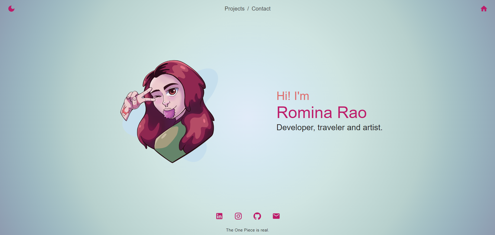
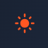
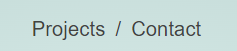
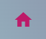
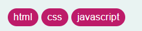
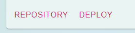

# **PORTFOLIO 2.0**

## ABOUT

Hey there! Thank you for taking the time to enter and check my beautiful portfolio! This README is just formal way to detail what you will see on the website!

 
    

## Skills used

 
    

## WEBSITE STRUCTURE / HOW TO USE IT

### ✦ Navbar

On the top of the document you can see the navigation bar.

-Mode Icon
You can see a moon or sun that if you click it, it will switch between dark and light mode. Your eyes are gratefull abou this, you're welcome.

 
    
    

-View links
You can change the main view to Projects or Contact with those links.

 
    

-Home button
In case you are in another view and want to go to my beautiful homepage you can click the home button on the top/right side of the corner.

 
    

### ✦ Projects

At this section you can see most of the projects I've been working on.

On every card you will be able to se an image and a description of what's about.
Also you can see some tags that show the knowledge applied on that project.

 
    

Also you have two buttons that lead you to the repositories and deployment of every project, in case you want to check the code and not only the website.

 
   

### ✦ Contact

Nothing else than my beautiful face. (?)
Just a small description of me and what I know, also, because I love spam myself, the links to my LinkedIn and mail.

## NEW KNOWLEDGE APPLIED

### ✦ Firestore

I've been tought about firestore apart of what we were learning on ADA so I decided to apply it here to learn better, also because it was better for me to put my projects information on a database instead of a huge and innecesary array inside the code.

## RESOURCES

-   CSS Framework -> [Material UI](https://mui.com/material-ui/)
-   Illustrations -> [Myself <3](https://www.instagram.com/renga.art/)
-   Data Base -> [FireStore](https://firebase.google.com/?hl=es)

## CONTACT ME

If you are interested in contacting me, as I say it on the project, you can find me on the following links:

-   [LinkedIn](https://www.linkedin.com/in/romina-rao-50a61a1ba/)
-   [raoromina96@gmail.com](mailto:raoromina96@gmail.com)
-   [Instagram](https://instagram.com/renga.art/)
-   [Check my other GitHub repositories](https://github.com/RomiRao?tab=repositories)
